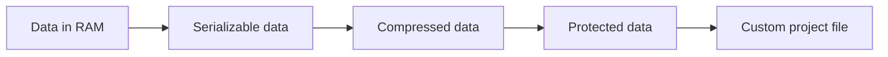
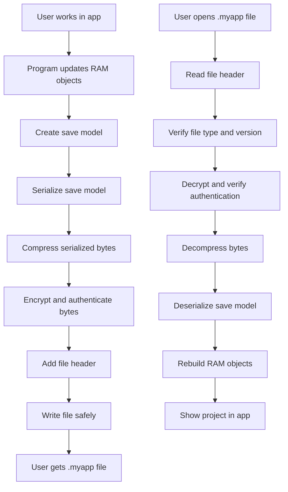
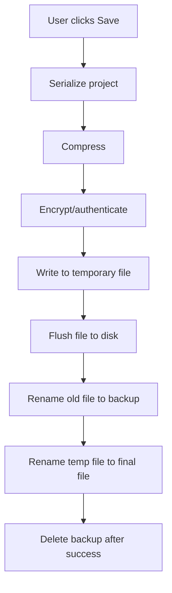

# Future Project File Blueprint

This guide explains how to design a program that can:

- Do useful work in RAM.
- Remember user choices.
- Save generated project data into a custom file.
- Open that file again later.
- Compress the file.
- Protect the file from normal editing.
- Let the operating system recognize your file extension.

Think of it like Photoshop:

```text
Photoshop RAM work -> Save as .psd -> Share .psd -> Open later in Photoshop
```

Your future software can follow the same idea:

```text
Your app RAM work -> Save as .yourExt -> Share .yourExt -> Open later in your app
```

## 1. The Big Idea

When your program is running, its data lives in RAM.

RAM data is fast, but temporary.

When the program closes, RAM disappears.

So you need to convert RAM data into file data.



## 2. Learn These Words First

| Word | Kid-Friendly Meaning |
| --- | --- |
| RAM data | The live objects your program is using right now. |
| Serialization | Turning RAM data into bytes that can be saved. |
| File format | The structure of those saved bytes. |
| Compression | Making the file smaller. |
| Encoding | Changing bytes into another representation, often text-safe. |
| Encryption | Locking data so others cannot read or edit it normally. |
| File association | Telling the OS which app opens your file extension. |

Important:

```text
Encoding is not security.
Compression is not security.
Encryption is security.
Authentication detects editing.
```

## 3. Full Save/Open Pipeline



## 4. Step 1: Separate Program Logic From Save Data

Your app usually has live working objects.

Example for a drawing app:

```text
Canvas object
Layer objects
Brush settings
Undo history
Selected tool
Zoom level
User preferences
```

Not all of this should go into the project file.

You should split data into groups.

| Data Type | Save In Project File? | Example |
| --- | --- | --- |
| Project content | Yes | Layers, shapes, images, text. |
| Project settings | Yes | Canvas size, color mode. |
| User choice for this project | Usually yes | Selected export quality for this project. |
| App preferences | Usually no, store separately | Dark mode, default folder, language. |
| Temporary UI state | Maybe | Current zoom, selected layer. |
| Cache data | No | Generated previews that can be rebuilt. |

Improvement tip:

Create one clean `ProjectData` structure that represents only what must be saved.

## 5. Step 2: Design Your Save Model

Do not directly save random RAM objects.

Create a simple save model.

Example:

```text
ProjectData
    version
    projectName
    createdAt
    modifiedAt
    canvasWidth
    canvasHeight
    layers[]
    settings
    assets[]
```

For each layer:

```text
LayerData
    id
    name
    visible
    opacity
    blendMode
    content
```

Why this matters:

RAM objects often contain things that cannot be saved directly, like:

- Pointers.
- File handles.
- Open windows.
- GPU textures.
- Temporary caches.

The save model should contain stable data only.

## 6. Step 3: Choose A Serialization Format

Serialization turns your save model into bytes.

Common choices:

| Format | Algorithm/Tool Name | Best For | Why Use It |
| --- | --- | --- | --- |
| JSON | JSON | Learning, debugging | Human-readable and easy. |
| XML | XML | Document-like data | Verbose but structured. |
| MessagePack | MessagePack | Compact binary data | Smaller than JSON. |
| CBOR | CBOR | Binary structured data | Good for typed data. |
| Protocol Buffers | Protobuf | Stable app formats | Version-friendly and efficient. |
| FlatBuffers | FlatBuffers | Fast loading | Can read without fully unpacking. |
| SQLite | SQLite database | Complex projects | Queryable and reliable. |
| ZIP package | ZIP container | Many files/assets | Easy to store manifest plus assets. |

Beginner recommendation:

```text
Start with JSON for learning.
Move to MessagePack, CBOR, Protobuf, or SQLite when the project grows.
```

## 7. Step 4: Add File Identity

Every custom file should start with a small header.

Example:

```text
MYAPPROJ
version: 1
flags: compressed + encrypted
```

In bytes, it might look like:

```text
Magic bytes       8 bytes   "MYAPP01\0"
File version      4 bytes
Header size       4 bytes
Flags             4 bytes
Payload bytes     remaining file data
```

Why magic bytes matter:

They let your app quickly check:

```text
Is this my file type?
```

Improvement tip:

Use a version number from day one. Future you will be grateful.

## 8. Step 5: Compress The Data

Compression makes files smaller.

Common compression algorithms:

| Algorithm | Best For | Why |
| --- | --- | --- |
| Deflate | General use | Used by ZIP, widely supported. |
| Zstandard / Zstd | Modern apps | Very good speed and compression. |
| LZ4 | Very fast saves/loads | Larger files but extremely fast. |
| Brotli | Text/web data | Great compression, slower. |
| LZMA | Maximum compression | Small files, slower saves. |

Good default:

```text
Zstandard if available.
Deflate if you want maximum compatibility.
```

Important:

Compression does not protect the file.

Anyone with the right tool can decompress it.

## 9. Step 6: Encode Only If Needed

Encoding changes data representation.

Example:

```text
Binary bytes -> Base64 text
```

Common encoding algorithms:

| Encoding | Use Case |
| --- | --- |
| Base64 | Put binary data inside text like JSON or email. |
| Hex | Debugging bytes. |
| UTF-8 | Store text. |

For normal project files, you usually do not need Base64.

Better:

```text
Write binary bytes directly to the file.
```

Use Base64 only when your file format is text-only.

## 10. Step 7: Protect The File

You said:

```text
without the software no one can edit it
```

There are two different goals:

| Goal | What You Need |
| --- | --- |
| Stop people reading the file | Encryption |
| Detect people editing the file | Authentication or digital signature |

Recommended modern algorithms:

| Algorithm | Use | Why |
| --- | --- | --- |
| AES-256-GCM | Encrypt + authenticate | Strong and widely supported. |
| ChaCha20-Poly1305 | Encrypt + authenticate | Strong and fast, good alternative. |
| HMAC-SHA-256 | Detect edits | Good if encryption is separate. |
| Ed25519 | Digital signature | Proves file came from your app/key. |
| Argon2id | Password-to-key | Best modern password KDF. |
| PBKDF2-HMAC-SHA256 | Password-to-key | Older but widely available. |

Best simple choice:

```text
AES-256-GCM
```

Why:

It encrypts the data and also detects changes.

Important truth:

If your software can open the file, a determined expert can eventually reverse
engineer your software. Encryption protects against normal editing, not magical
unbreakable protection.

## 11. Step 8: Key Management

Encryption needs a key.

Your choices:

| Method | How It Works | Good For |
| --- | --- | --- |
| App-owned key | Key is inside the app | Basic hiding, weak against experts. |
| User password | User enters password | Private user files. |
| License/account key | Key comes from server/account | Commercial apps. |
| Public/private signing key | App verifies signature | Detecting unofficial edits. |

If using a password:

```text
password + salt -> Argon2id -> encryption key
```

Store the salt in the file header.

Do not store the password.

Do not store the raw encryption key.

## 12. Step 9: Design The File Container

A good project file often acts like a small box.

Inside the box:

```text
Header
Manifest
Project data
Assets
Thumbnails
Metadata
```

Two common designs:

### Single Binary Blob

```text
Header + encrypted compressed payload
```

Good for:

- Simpler apps.
- One main data object.
- Strong protection.

### ZIP-Like Package

```text
project.myapp
    manifest.json
    data/project.bin
    assets/image001.png
    assets/audio001.wav
    preview/thumbnail.png
```

Good for:

- Projects with many assets.
- Easier debugging.
- Easier partial loading.

If you need protection, encrypt the package or encrypt important files inside it.

## 13. Step 10: Save Safely

Never save directly over the old file first.

Use atomic save.

Safe save algorithm:



Why:

If the computer crashes while saving, the old project is not destroyed.

Useful techniques:

| Technique | Why |
| --- | --- |
| Temporary file | Avoid corrupting original. |
| Backup file | Recover if save fails. |
| File flush | Push bytes to disk. |
| Atomic rename | Final switch happens quickly. |

## 14. Step 11: Open Safely

Open algorithm:

```text
1. Read header.
2. Check magic bytes.
3. Check version.
4. Check flags.
5. Read payload.
6. Decrypt and authenticate.
7. Decompress.
8. Deserialize.
9. Validate all data.
10. Rebuild RAM objects.
11. Show project.
```

Validation examples:

| Check | Why |
| --- | --- |
| Width and height are reasonable | Avoid giant fake projects. |
| Layer count has a limit | Avoid memory attacks. |
| Asset sizes have limits | Avoid huge file crashes. |
| IDs are unique | Avoid broken references. |
| Required fields exist | Avoid half-loaded projects. |

## 15. Step 12: Remember User Choices

There are two kinds of memory.

### Project-Specific Choices

Save inside the project file.

Examples:

- Last selected layer.
- Export settings for this project.
- Project color profile.
- Project units.

### App-Wide Choices

Save in app settings, not the project file.

Examples:

- Dark mode.
- Default save folder.
- Window size.
- Recently opened files.
- Preferred language.

Common app settings storage:

| Platform | Storage |
| --- | --- |
| Windows | `%APPDATA%`, Registry, or local config file. |
| macOS | Preferences plist. |
| Linux | `~/.config/yourapp/config.json`. |

For learning:

```text
Use a settings.json file first.
```

## 16. Step 13: Make OS Recognize Your Extension

Pick an extension:

```text
.myproj
.rkd
.abcproj
```

Windows file association:

```text
HKEY_CURRENT_USER\Software\Classes\.myproj
    (Default) = MyApp.ProjectFile

HKEY_CURRENT_USER\Software\Classes\MyApp.ProjectFile
    (Default) = My App Project

HKEY_CURRENT_USER\Software\Classes\MyApp.ProjectFile\shell\open\command
    (Default) = "C:\Path\MyApp.exe" "%1"

HKEY_CURRENT_USER\Software\Classes\MyApp.ProjectFile\DefaultIcon
    (Default) = "C:\Path\MyApp.exe",0
```

Do this in:

- Installer.
- First-run setup.
- A menu option like `Register File Type`.

Important:

Use `HKEY_CURRENT_USER` if you do not want administrator permission.

For other operating systems:

| OS | Association Method |
| --- | --- |
| Windows | Registry file association. |
| macOS | App bundle `Info.plist` document types / UTType. |
| Linux | MIME type XML + `.desktop` file. |

## 17. Recommended Beginner Architecture

Use layers.

```text
UI layer
    Shows buttons, menus, screens.

Logic layer
    Performs the main work.

Project model layer
    Holds the clean data that can be saved.

Serialization layer
    Converts project model to bytes and back.

Compression layer
    Makes bytes smaller.

Security layer
    Encrypts and verifies bytes.

File system layer
    Reads and writes files safely.

OS integration layer
    Registers file extension and icons.
```

Why layers help:

If your save format changes, your UI does not need to change much.

## 18. Example Generic Save Pseudocode

```text
function saveProject(project, path):
    saveModel = createSaveModelFromRam(project)
    validateSaveModel(saveModel)

    serializedBytes = serialize(saveModel)
    compressedBytes = compress(serializedBytes)
    protectedBytes = encryptAndAuthenticate(compressedBytes)

    header = createHeader(
        magic = "MYAPP01",
        version = 1,
        compression = "zstd",
        encryption = "aes-256-gcm"
    )

    fileBytes = header + protectedBytes
    atomicWrite(path, fileBytes)
```

## 19. Example Generic Open Pseudocode

```text
function openProject(path):
    fileBytes = readAllBytes(path)

    header = parseHeader(fileBytes)
    checkMagic(header.magic)
    checkVersion(header.version)

    protectedBytes = getPayload(fileBytes)
    compressedBytes = decryptAndVerify(protectedBytes)
    serializedBytes = decompress(compressedBytes)

    saveModel = deserialize(serializedBytes)
    validateSaveModel(saveModel)

    project = rebuildRamProject(saveModel)
    showProject(project)
```

## 20. Algorithm Choices By Project Size

### Small Learning Project

```text
Serialization: JSON
Compression: Deflate or none
Protection: HMAC-SHA-256 or none
File container: single file
Settings: settings.json
```

### Serious Desktop App

```text
Serialization: Protobuf, MessagePack, CBOR, or SQLite
Compression: Zstandard
Protection: AES-256-GCM
File container: binary package or ZIP-like package
Settings: platform app data folder
```

### Large Creative App Like Photoshop

```text
Serialization: chunked binary format
Compression: per-layer or per-asset compression
Protection: optional encryption/signing
File container: indexed sections with previews
Settings: app config + project metadata
```

## 21. Suggested File Layout For A Future Project

```text
MyApp/
    src/
        main.cpp
        app/
            App.cpp
            App.h
        logic/
            ProjectLogic.cpp
            ProjectLogic.h
        model/
            ProjectData.cpp
            ProjectData.h
        storage/
            ProjectSerializer.cpp
            ProjectSerializer.h
            ProjectFile.cpp
            ProjectFile.h
            Compression.cpp
            Compression.h
            Encryption.cpp
            Encryption.h
        settings/
            UserSettings.cpp
            UserSettings.h
        platform/
            WindowsFileAssociation.cpp
            WindowsFileAssociation.h
    docs/
        file-format.md
        architecture.md
```

## 22. Minimum Checklist For Every Custom Project File

Before calling your file format finished, check this:

- Does the file have magic bytes?
- Does the file have a version number?
- Can old files still open after updates?
- Does loading validate sizes and counts?
- Does saving use a temporary file first?
- Does the program avoid saving raw pointers?
- Can the project be shared to another computer?
- Are missing assets handled clearly?
- Is compression optional or versioned?
- If encrypted, where does the key come from?
- Can the OS open the file by double-clicking it?
- Can the app unregister the file type?

## 23. Simple Rule To Remember

```text
RAM objects are for working.
Save models are for storing.
Serialized bytes are for files.
Compressed bytes are for smaller files.
Encrypted bytes are for protection.
File association is for OS double-click support.
```

## 24. Best Learning Order

Build future projects in this order:

1. Make the logic work in RAM.
2. Create a clean save model.
3. Save and load using JSON.
4. Add file magic and version.
5. Add validation.
6. Add safe save with temporary file.
7. Add compression.
8. Add encryption/authentication if needed.
9. Add app settings for user choices.
10. Add OS file association.
11. Add tests for every step.

Do not start with encryption or file association.

Start with this:

```text
Can I save my project?
Can I close the app?
Can I open the project and get the same result?
```

After that works, make the file smaller, safer, and easier for the OS to
recognize.

