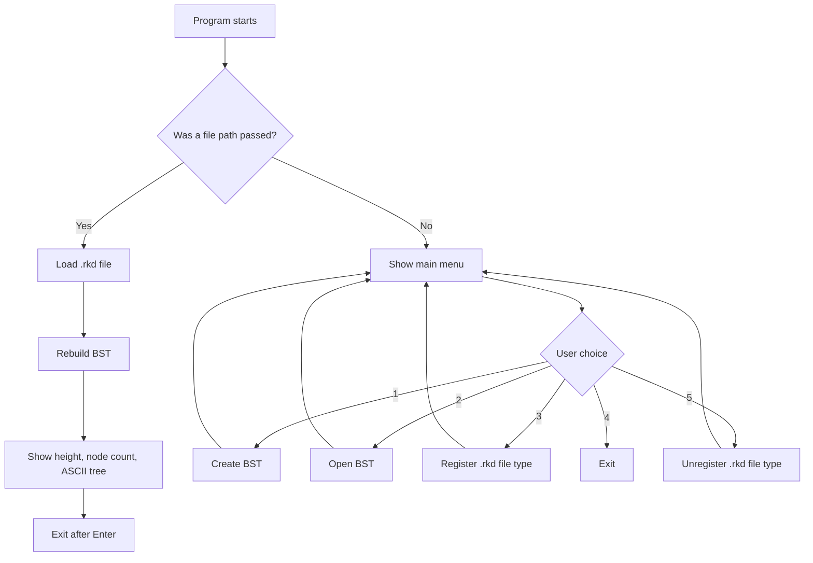
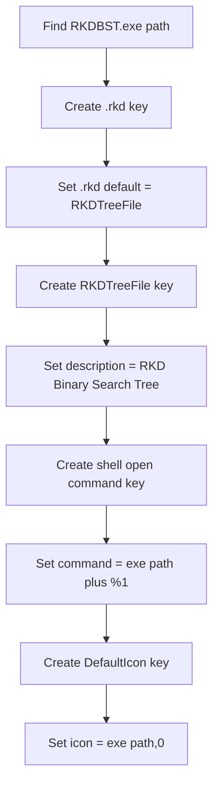
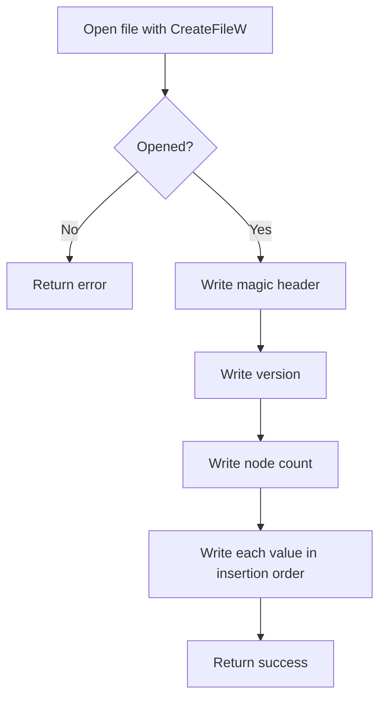
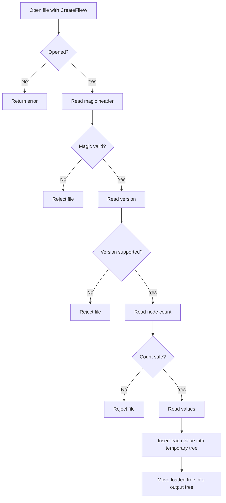
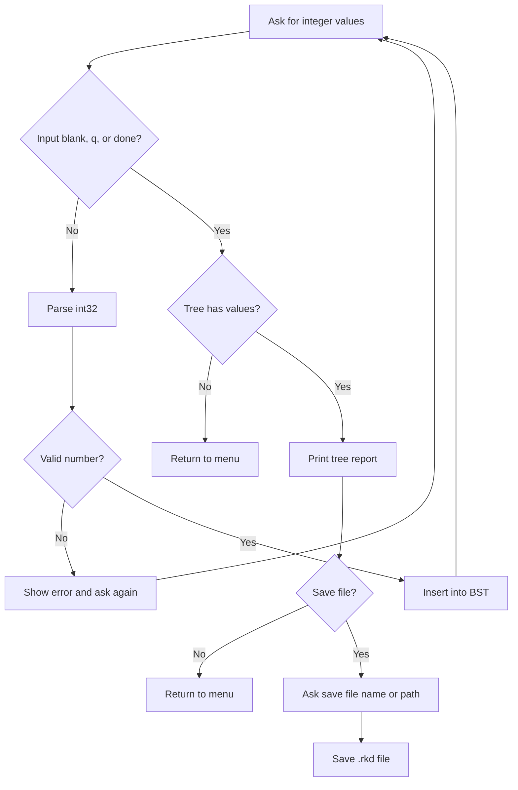
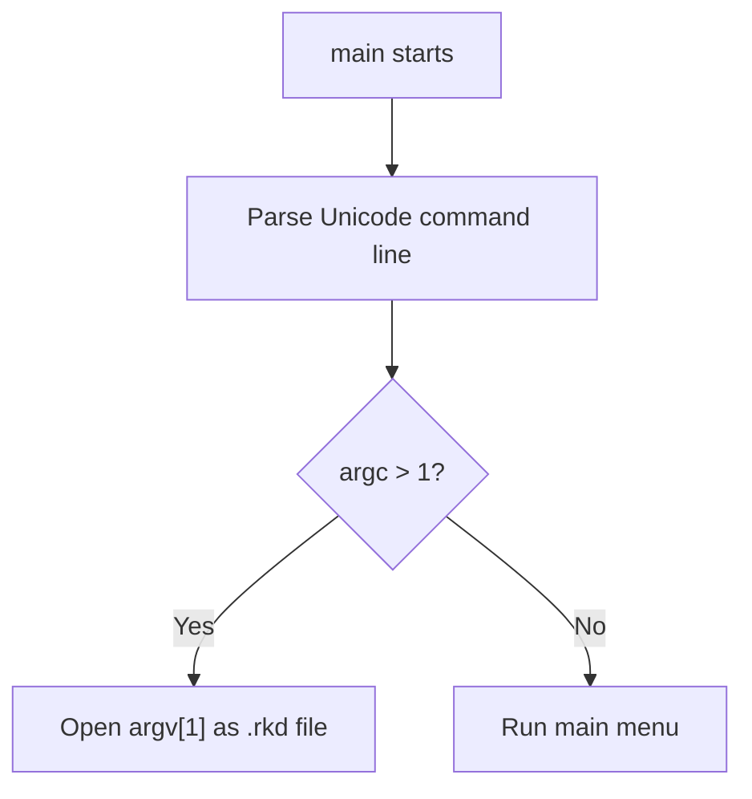

# RKDBST.cpp Full Code Walkthrough

This document explains `RKDBST.cpp` from top to bottom. It is written for
learning, so each section explains:

- What the code does.
- Why it exists.
- How it connects to the rest of the program.
- What you can improve later.

Source file:

```text
RKDBST.cpp
```

Built program:

```text
RKDBST.exe
```

## Big Picture

`RKDBST.cpp` is a Windows console application for managing Binary Search Tree
files with the `.rkd` extension.

The program can:

| Feature | What It Means |
| --- | --- |
| Create BST | User enters numbers, and the app inserts them into a BST. |
| Save BST | The tree values are saved into a custom binary `.rkd` file. |
| Open BST | The app loads `.rkd` values and reconstructs the BST. |
| Show stats | The app displays height, node count, and ASCII visualization. |
| Register `.rkd` | The app can associate `.rkd` files with `RKDBST.exe`. |
| Unregister `.rkd` | The app can remove the file association it created. |
| Direct file open | If Windows runs `RKDBST.exe "file.rkd"`, the app opens that file immediately. |

## Program Flow



## File Format

The `.rkd` file stores values in insertion order.

That matters because a BST shape depends on insertion order.

Example:

```text
Insert: 10, 5, 15
Tree:
    10
   /  \
  5    15
```

If the program saves the values in the same order, it can rebuild the same tree
later by inserting them again.

### `.rkd` Binary Layout

```text
+----------------------+----------------------+
| Part                 | Size                 |
+----------------------+----------------------+
| Magic header         | 8 bytes              |
| File version         | 4 bytes uint32       |
| Node count           | 8 bytes uint64       |
| Node value 1         | 4 bytes int32        |
| Node value 2         | 4 bytes int32        |
| ...                  | ...                  |
+----------------------+----------------------+
```

The magic header is:

```cpp
{'R', 'K', 'D', 'B', 'S', 'T', '1', '\0'}
```

Improvement idea:

Add a checksum at the end of the file so the program can detect damaged files
more strongly.

## Top To Bottom Code Tour

## 1. `#define NOMINMAX`

```cpp
#define NOMINMAX
```

Windows headers sometimes define macros named `min` and `max`.

That can break normal C++ code that uses:

```cpp
std::min
std::max
```

`NOMINMAX` tells Windows headers not to create those macros.

Improvement idea:

Keep platform-specific defines near the top of the file so future readers see
them before includes.

## 2. Windows Headers

```cpp
#include <windows.h>
#include <shellapi.h>
```

`windows.h` gives access to:

| API | Used For |
| --- | --- |
| Registry APIs | Create and delete file association keys. |
| `GetModuleFileNameW` | Find the path of the running `.exe`. |
| `CreateFileW` | Open `.rkd` files with Unicode Windows paths. |
| `ReadFile` | Read binary `.rkd` file data. |
| `WriteFile` | Write binary `.rkd` file data. |
| `CloseHandle` | Close file handles. |
| `FormatMessageW` | Convert Windows error codes to messages. |

`shellapi.h` gives access to:

| API | Used For |
| --- | --- |
| `CommandLineToArgvW` | Convert the raw command line into Unicode arguments. |

Improvement idea:

If the file grows larger, move Windows-specific helpers into a separate
`windows_helpers.cpp` file.

## 3. Standard C++ Headers

```cpp
#include <algorithm>
#include <array>
#include <cstdint>
#include <cwctype>
#include <iostream>
#include <limits>
#include <memory>
#include <sstream>
#include <string>
#include <vector>
```

These headers support the normal C++ parts of the app.

| Header | Used For |
| --- | --- |
| `<algorithm>` | `std::max`, `std::find_if_not`. |
| `<array>` | Fixed-size magic header. |
| `<cstdint>` | Exact integer sizes like `int32_t`. |
| `<cwctype>` | Wide-character lowercase and whitespace checks. |
| `<iostream>` | Console input and output. |
| `<limits>` | Minimum and maximum integer values. |
| `<memory>` | `std::unique_ptr` for automatic memory cleanup. |
| `<sstream>` | Build error text with streams. |
| `<string>` | `std::wstring`. |
| `<vector>` | Store insertion order values. |

Improvement idea:

Keep includes minimal. If you remove a feature, remove unused includes too.

## 4. Visual Studio Library Pragmas

```cpp
#ifdef _MSC_VER
#pragma comment(lib, "Advapi32.lib")
#pragma comment(lib, "Shell32.lib")
#endif
```

This block only affects Microsoft Visual C++.

It tells Visual Studio to link:

| Library | Needed For |
| --- | --- |
| `Advapi32.lib` | Windows Registry functions. |
| `Shell32.lib` | `CommandLineToArgvW`. |

MinGW uses command-line flags instead:

```powershell
g++ -std=c++17 RKDBST.cpp -ladvapi32 -lshell32 -o RKDBST.exe
```

Improvement idea:

Create a `build.bat` file later so you do not need to remember the full command.

## 5. `RegDeleteTreeW` Compatibility Declaration

```cpp
extern "C" WINADVAPI LONG WINAPI RegDeleteTreeW(HKEY hKey, LPCWSTR lpSubKey);
```

The installed MinGW compiler had older Windows headers that did not declare
`RegDeleteTreeW`.

The function still exists in `Advapi32.dll`, so the code declares it manually.

Why `extern "C"`?

It prevents C++ name mangling so the linker can find the Windows API function
by its expected name.

Improvement idea:

If you upgrade to a newer compiler, this declaration may no longer be needed.

## 6. Anonymous Namespace

```cpp
namespace
{
    ...
}
```

Most of the program is inside an anonymous namespace.

That means the functions and classes are private to this file.

Why this is useful:

| Benefit | Meaning |
| --- | --- |
| Avoids name conflicts | Other files cannot accidentally use the same names. |
| Shows ownership | These helpers belong only to `RKDBST.cpp`. |
| Cleaner design | Only `main()` is exposed outside the namespace. |

Improvement idea:

If this project becomes multi-file, move shared declarations into `.h` headers
and keep file-private helpers in anonymous namespaces.

## 7. Registry Constants

```cpp
constexpr const wchar_t* kRkdExtensionKey = L"Software\\Classes\\.rkd";
constexpr const wchar_t* kRkdProgId = L"RKDTreeFile";
constexpr const wchar_t* kRkdProgIdKey = L"Software\\Classes\\RKDTreeFile";
constexpr const wchar_t* kRkdCommandKey =
    L"Software\\Classes\\RKDTreeFile\\shell\\open\\command";
constexpr const wchar_t* kRkdIconKey =
    L"Software\\Classes\\RKDTreeFile\\DefaultIcon";
```

These strings define where the file association is stored in the registry.

The app uses `HKEY_CURRENT_USER`, so the real paths are:

```text
HKEY_CURRENT_USER\Software\Classes\.rkd
HKEY_CURRENT_USER\Software\Classes\RKDTreeFile
HKEY_CURRENT_USER\Software\Classes\RKDTreeFile\shell\open\command
HKEY_CURRENT_USER\Software\Classes\RKDTreeFile\DefaultIcon
```

Improvement idea:

Before writing these keys, read any existing `.rkd` association and ask the user
if they want to replace it.

## 8. File Format Constants

```cpp
constexpr std::array<char, 8> kRkdMagic = {'R', 'K', 'D', 'B', 'S', 'T', '1', '\0'};
constexpr std::uint32_t kRkdFileVersion = 1;
constexpr std::uint64_t kMaxNodesToLoad = 1'000'000;
```

These constants protect file loading.

| Constant | Purpose |
| --- | --- |
| `kRkdMagic` | Confirms the file is probably an RKD BST file. |
| `kRkdFileVersion` | Allows future versions of the file format. |
| `kMaxNodesToLoad` | Prevents loading a file that claims a dangerous number of nodes. |

Improvement idea:

Add a file-format document that explains each byte of the `.rkd` file.

## 9. `RegistryKey` Class

```cpp
class RegistryKey
```

This class owns an `HKEY`.

When the object is destroyed, it automatically calls:

```cpp
RegCloseKey(key_);
```

That is called RAII:

```text
Resource Acquisition Is Initialization
```

In simple words:

```text
Object owns resource.
Object destructor releases resource.
```

Important functions:

| Function | Purpose |
| --- | --- |
| `get()` | Returns the current `HKEY`. |
| `put()` | Closes old key and returns address for Windows API output. |
| `close()` | Manually closes the key if it is open. |

Improvement idea:

Reuse this pattern for any future Windows resource that needs cleanup.

## 10. `FileHandle` Class

```cpp
class FileHandle
```

This class owns a Windows file `HANDLE`.

It closes the handle with:

```cpp
CloseHandle(handle_);
```

It treats this as invalid:

```cpp
INVALID_HANDLE_VALUE
```

Important functions:

| Function | Purpose |
| --- | --- |
| `valid()` | Checks if the file opened successfully. |
| `get()` | Gives the raw handle to `ReadFile` or `WriteFile`. |
| `close()` | Closes the handle early if needed. |

Improvement idea:

You could add move constructor support so `FileHandle` can be returned from
helper functions.

## 11. `formatWindowsError`

```cpp
std::wstring formatWindowsError(LONG status)
```

This function turns Windows error codes into readable text.

Example:

```text
Access is denied. (code 5)
```

It uses:

```cpp
FormatMessageW
```

Then it removes extra line breaks from the Windows message.

Used by:

- Registry registration errors.
- Registry unregister errors.
- File open errors.

Improvement idea:

Add the name of the failing operation to every error message, such as
`CreateFileW failed`.

## 12. `getExecutablePath`

```cpp
std::wstring getExecutablePath()
```

This finds the full path of the running program.

It uses:

```cpp
GetModuleFileNameW(nullptr, ...)
```

The registry needs this path so double-clicking a `.rkd` file can run:

```text
"C:\Path\RKDBST.exe" "%1"
```

Why it resizes the buffer:

Some executable paths are longer than `MAX_PATH`, so the code keeps expanding
the buffer until the full path fits.

Improvement idea:

Show the detected executable path before registration so the user knows exactly
what command is being saved.

## 13. `createWritableRegistryKey`

```cpp
LONG createWritableRegistryKey(HKEY root, const wchar_t* subKey, RegistryKey& key)
```

This creates or opens a registry key.

It uses:

```cpp
RegCreateKeyExW
```

Requested access:

```cpp
KEY_SET_VALUE | KEY_CREATE_SUB_KEY
```

That means the app can:

- Set the default value.
- Create child keys.

Improvement idea:

Log whether the key was newly created or already existed by checking the
`disposition` output.

## 14. `setDefaultRegistryString`

```cpp
LONG setDefaultRegistryString(HKEY key, const std::wstring& value)
```

This writes a default registry value.

It uses:

```cpp
RegSetValueExW
```

Passing `nullptr` as the value name means:

```text
(Default)
```

It writes the value as:

```text
REG_SZ
```

Improvement idea:

Make a second helper for named values if the app later stores settings.

## 15. `registerRkdFileType`

```cpp
bool registerRkdFileType()
```

This creates the file association.

Registry flow:



The most important command is:

```cpp
const std::wstring openCommand = L"\"" + exePath + L"\" \"%1\"";
```

That becomes:

```text
"C:\...\RKDBST.exe" "%1"
```

When a user double-clicks:

```text
mytree.rkd
```

Windows replaces `%1` with:

```text
C:\Full\Path\mytree.rkd
```

Improvement idea:

After writing registry keys, verify them by reading them back.

## 16. `unregisterRkdFileType`

```cpp
bool unregisterRkdFileType()
```

This removes the keys created by registration.

It opens:

```text
HKEY_CURRENT_USER\Software\Classes
```

Then deletes:

```text
.rkd
RKDTreeFile
```

It uses:

```cpp
RegDeleteTreeW
```

Why `RegDeleteTreeW`?

Because `RKDTreeFile` has child keys:

```text
shell\open\command
DefaultIcon
```

`RegDeleteTreeW` deletes the whole branch.

Improvement idea:

Save previous association data during registration, then restore it during
unregistration.

## 17. `trim`

```cpp
std::wstring trim(std::wstring text)
```

This removes whitespace from the beginning and end of a string.

Example:

```text
"   25  " -> "25"
```

Used by:

- Menu input.
- Number parsing.
- Yes/no answers.
- Path input cleanup.

Improvement idea:

Add tests for empty strings, spaces-only strings, and mixed tabs/newlines.

## 18. `cleanPathInput`

```cpp
std::wstring cleanPathInput(const std::wstring& text)
```

This cleans file paths typed by the user.

It removes:

- Outer whitespace.
- One pair of surrounding quotes.

Example:

```text
"C:\Trees\mytree.rkd" -> C:\Trees\mytree.rkd
```

Improvement idea:

Add support for dragging a file path into the console, then cleaning the result.

## 19. `toLower`

```cpp
std::wstring toLower(std::wstring text)
```

This converts text to lowercase.

Used for:

- `q`
- `done`
- `yes`
- `no`

Improvement idea:

For international text, use a more complete Unicode-aware lowercase method.

## 20. `tryParseInt32`

```cpp
bool tryParseInt32(const std::wstring& text, std::int32_t& value)
```

This safely converts text into a 32-bit integer.

It rejects:

| Input | Why Rejected |
| --- | --- |
| Empty text | No number. |
| `12abc` | Partial number only. |
| Very large number | Outside `int32_t` range. |
| Very small number | Outside `int32_t` range. |

It accepts:

```text
10
-5
0
2147483647
```

Improvement idea:

Return a detailed error reason instead of only true or false.

## 21. `BinarySearchTree`

```cpp
class BinarySearchTree
```

This class stores and operates on the BST.

Main public functions:

| Function | Purpose |
| --- | --- |
| `insert(value)` | Adds one value to the tree. |
| `empty()` | Checks if there are no nodes. |
| `nodeCount()` | Returns how many values were inserted. |
| `height()` | Returns tree height. |
| `insertionOrder()` | Returns values in original insert order. |
| `printAscii()` | Prints a sideways tree. |

## 22. `BinarySearchTree::Node`

```cpp
struct Node
{
    std::int32_t value;
    std::unique_ptr<Node> left;
    std::unique_ptr<Node> right;
};
```

Each node stores:

- One number.
- A left child.
- A right child.

`std::unique_ptr` automatically deletes child nodes when the tree is destroyed.

Improvement idea:

Add a parent pointer only if you need upward traversal. Do not add it unless a
feature needs it.

## 23. BST Insert Rule

```cpp
if (value < node->value)
{
    insertInto(node->left, value);
}
else
{
    insertInto(node->right, value);
}
```

Rules:

| Case | Direction |
| --- | --- |
| New value is smaller | Go left. |
| New value is equal or larger | Go right. |

Duplicates are preserved because equal values go right.

Example:

```text
Insert: 10, 10, 10

10
  \
   10
     \
      10
```

Improvement idea:

If you do not want duplicates, reject equal values or store a duplicate count
inside each node.

## 24. Height Calculation

```cpp
return 1 + std::max(heightOf(node->left.get()), heightOf(node->right.get()));
```

Height means the number of node levels.

Examples:

| Tree | Height |
| --- | --- |
| Empty tree | 0 |
| One root node | 1 |
| Root plus one child | 2 |

Improvement idea:

For very deep unbalanced trees, recursion could become too deep. An iterative
height function can avoid that.

## 25. ASCII Tree Printing

```cpp
void printAscii() const
```

The tree is printed sideways.

Right children appear above parents.
Left children appear below parents.

Example:

```text
(right children appear above parents)
    /-- 15
10
    \-- 5
```

Improvement idea:

Add a top-down tree renderer for a more natural visual layout.

## 26. Binary Read/Write Helpers

```cpp
bool writeBytes(HANDLE file, const void* data, DWORD byteCount)
bool readBytes(HANDLE file, void* data, DWORD byteCount)
```

These wrap:

```cpp
WriteFile
ReadFile
```

They check that the exact number of requested bytes was written or read.

Improvement idea:

For very large files, support chunked reads and writes.

## 27. POD Helpers

```cpp
template <typename T>
bool writePod(HANDLE file, const T& value)

template <typename T>
bool readPod(HANDLE file, T& value)
```

POD here means a simple fixed-size value, such as:

- `std::uint32_t`
- `std::uint64_t`
- `std::int32_t`

These helpers avoid repeating byte-write code.

Improvement idea:

If you make the file format cross-platform, explicitly write little-endian
bytes instead of relying on the computer's native byte order.

## 28. `saveTreeToFile`

```cpp
bool saveTreeToFile(
    const BinarySearchTree& tree,
    const std::wstring& path,
    std::wstring& error)
```

This saves a tree into a `.rkd` file.

Save flow:



Why insertion order is saved:

```text
Same inserted values in same order = same BST shape
```

Improvement idea:

Warn the user before overwriting an existing file.

## 29. `loadTreeFromFile`

```cpp
bool loadTreeFromFile(
    const std::wstring& path,
    BinarySearchTree& tree,
    std::wstring& error)
```

This loads values from a `.rkd` file and rebuilds the tree.

Load flow:



Important safety detail:

The function loads into a temporary tree first.

Only after the full file is valid does it assign:

```cpp
tree = std::move(loadedTree);
```

That prevents a bad file from partly replacing a good tree.

Improvement idea:

Check for extra trailing bytes and warn if the file contains unexpected data.

## 30. `withDefaultRkdExtension`

```cpp
std::wstring withDefaultRkdExtension(std::wstring path)
```

This adds `.rkd` if the user did not type an extension.

Example:

```text
mytree -> mytree.rkd
mytree.rkd -> mytree.rkd
C:\Trees\mytree -> C:\Trees\mytree.rkd
```

Improvement idea:

Reject empty paths before trying to save.

## 31. `hasUsableFileName`

```cpp
bool hasUsableFileName(const std::wstring& path)
```

This checks that the save path has a real file name.

It rejects:

```text
empty text
.rkd
C:\SomeFolder\
.
..
```

Why this was added:

Without this check, an empty save input could become `.rkd`, which is only an
extension and not a useful project name.

Valid examples:

```text
mytree
mytree.rkd
C:\Trees\mytree.rkd
```

Improvement idea:

A GUI save dialog would make this cleaner because it can separate folder,
filename, and extension for the user.

## 32. `printTreeReport`

```cpp
void printTreeReport(const BinarySearchTree& tree, const std::wstring& title)
```

This prints:

- Title.
- Height.
- Node count.
- ASCII visualization.

It centralizes reporting so loaded and newly created trees display the same
style.

Improvement idea:

Add traversal output:

- In-order.
- Pre-order.
- Post-order.

## 33. `waitForEnter`

```cpp
void waitForEnter(const std::wstring& prompt)
```

This pauses the console until the user presses Enter.

It helps users read output before the screen changes.

Improvement idea:

Only pause in interactive mode. Automated tests usually prefer no pauses.

## 34. `askYesNo`

```cpp
bool askYesNo(const std::wstring& prompt)
```

This asks a yes/no question.

Accepted yes values:

```text
y
yes
```

Everything else is treated as no.

Improvement idea:

Keep asking until the user types a clear yes or no.

## 35. `createBstMenu`

```cpp
void createBstMenu()
```

This handles menu option 1:

```text
1. Create BST
```

Create flow:



The user finishes input by typing:

```text
q
done
```

or by pressing Enter on a blank line.

Improvement idea:

Add commands inside creation mode:

```text
search 25
delete 10
clear
print
```

Save name behavior:

```text
mytree -> mytree.rkd
mytree.rkd -> mytree.rkd
blank input -> rejected
.rkd -> rejected
q or cancel -> cancels saving
```

## 36. `openBstMenu`

```cpp
void openBstMenu()
```

This handles menu option 2:

```text
2. Open BST
```

It asks for a path, loads the file, then prints the report.

Improvement idea:

Add a recent files list so the user can reopen files quickly.

## 37. `openBstFromCommandLine`

```cpp
int openBstFromCommandLine(const wchar_t* rawPath)
```

This handles double-click startup.

When `.rkd` is registered, Windows runs:

```text
RKDBST.exe "C:\Trees\mytree.rkd"
```

That path is passed into this function.

It then:

1. Cleans the path.
2. Loads the file.
3. Rebuilds the BST.
4. Prints height.
5. Prints node count.
6. Prints ASCII tree.
7. Waits for Enter before exiting.

Improvement idea:

If you make a GUI version, this function should open the file in the main
window instead of printing to console.

## 38. `printMainMenu`

```cpp
void printMainMenu()
```

This prints:

```text
RKD BST Manager
1. Create BST
2. Open BST
3. Register .rkd File Type
4. Exit
5. Unregister .rkd File Type
Choice:
```

Improvement idea:

Put unregister before exit if you want the numbers to be more natural:

```text
1. Create BST
2. Open BST
3. Register .rkd File Type
4. Unregister .rkd File Type
5. Exit
```

## 39. `runMainMenu`

```cpp
void runMainMenu()
```

This is the main interactive loop.

It:

1. Prints the menu.
2. Reads the user's choice.
3. Parses it as an integer.
4. Runs the matching menu action.
5. Repeats until the user chooses exit.

Switch behavior:

| Choice | Function |
| --- | --- |
| `1` | `createBstMenu()` |
| `2` | `openBstMenu()` |
| `3` | Confirm, then `registerRkdFileType()` |
| `4` | Exit loop |
| `5` | Confirm, then `unregisterRkdFileType()` |

Important safety design:

The registry options ask for confirmation before changing anything.

Improvement idea:

Show current association status next to register/unregister options.

## 40. `main`

```cpp
int main()
```

This is where the program starts.

It uses:

```cpp
CommandLineToArgvW(GetCommandLineW(), &argc)
```

Why?

Normal `main(int argc, char* argv[])` can lose Unicode path information on
Windows. `CommandLineToArgvW` gives wide-character arguments.

Startup decision:



If a path exists:

```cpp
return openBstFromCommandLine(argv[1]);
```

If no path exists:

```cpp
runMainMenu();
return 0;
```

Improvement idea:

Add command flags later:

```text
RKDBST.exe --register
RKDBST.exe --unregister
RKDBST.exe --help
```

## Registry Association Summary

When the user chooses registration, this app creates:

```text
HKEY_CURRENT_USER\Software\Classes\.rkd
    (Default) = RKDTreeFile

HKEY_CURRENT_USER\Software\Classes\RKDTreeFile
    (Default) = RKD Binary Search Tree

HKEY_CURRENT_USER\Software\Classes\RKDTreeFile\shell\open\command
    (Default) = "FULL_PATH_TO_EXE" "%1"

HKEY_CURRENT_USER\Software\Classes\RKDTreeFile\DefaultIcon
    (Default) = "FULL_PATH_TO_EXE",0
```

The key idea:

```text
.rkd -> RKDTreeFile -> shell open command -> RKDBST.exe "%1"
```

## Main Data Relationships


## Important Safety Choices

| Choice | Why It Matters |
| --- | --- |
| `HKEY_CURRENT_USER` | No administrator permission needed. |
| Registry confirmation prompts | User must confirm file association changes. |
| `kMaxNodesToLoad` | Avoids loading unrealistic node counts. |
| Temporary tree during load | Bad files do not partly overwrite a good tree. |
| RAII wrappers | Registry keys and file handles close automatically. |
| Unicode Windows APIs | Paths with non-English characters work better. |

## Best Places To Improve Next

| Area | Improvement |
| --- | --- |
| User interface | Add a GUI or clearer console screens. |
| Tree features | Add search, delete, traversal, and balancing. |
| File format | Add checksum, compression, and version migration. |
| Registry support | Save and restore previous `.rkd` association. |
| Testing | Add automated tests for save/load and invalid files. |
| Build process | Add `build.bat` or `Makefile`. |
| Documentation | Add screenshots and sample tree diagrams. |

## Suggested Learning Path

Read the code in this order:

1. Start with `main()`.
2. Follow `runMainMenu()`.
3. Read `createBstMenu()` and `openBstMenu()`.
4. Study `BinarySearchTree`.
5. Study `saveTreeToFile()` and `loadTreeFromFile()`.
6. Study `registerRkdFileType()` and `unregisterRkdFileType()`.
7. Return to the small helper functions.

This order is easier than reading line 1 first because it starts with program
behavior, then moves into implementation details.
